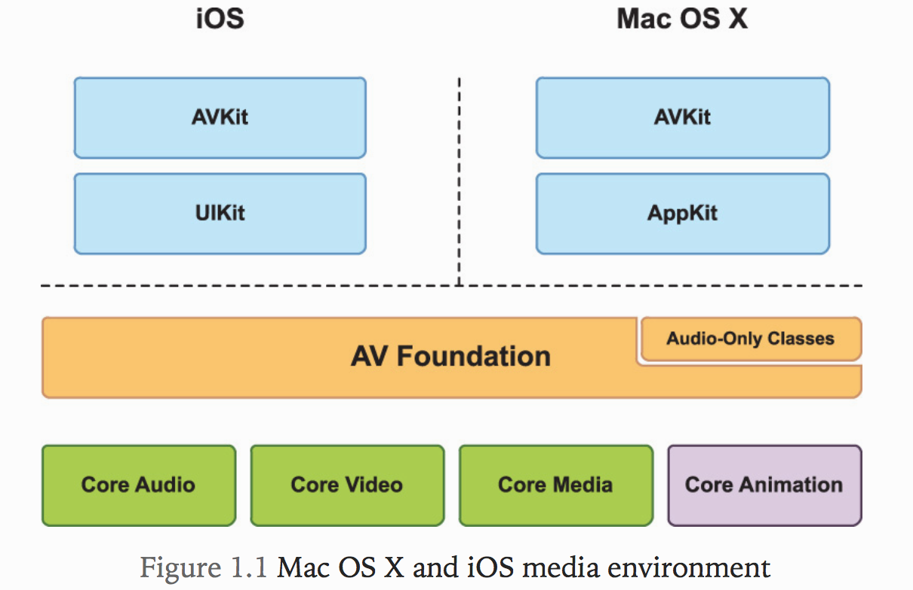
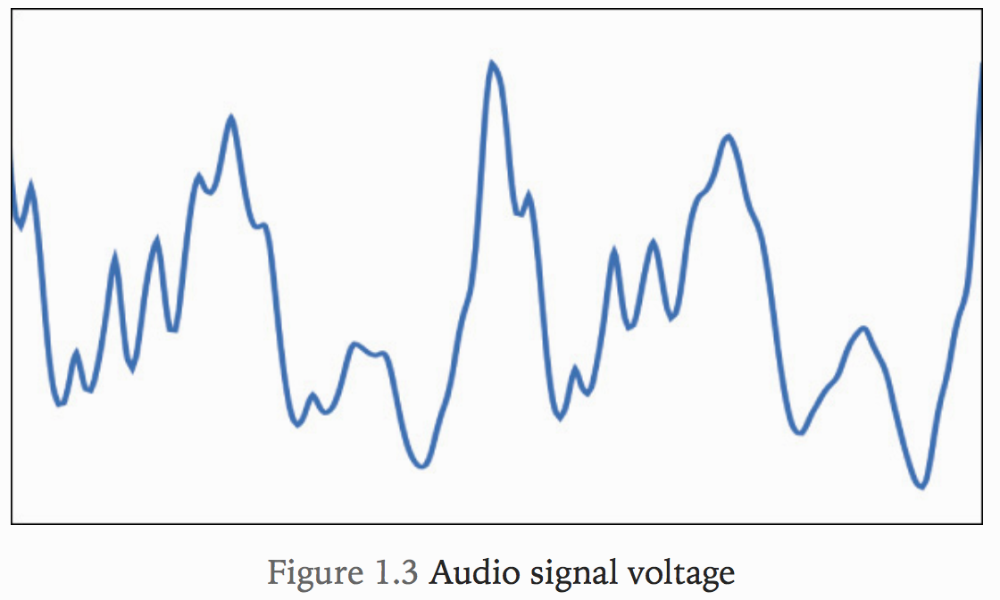
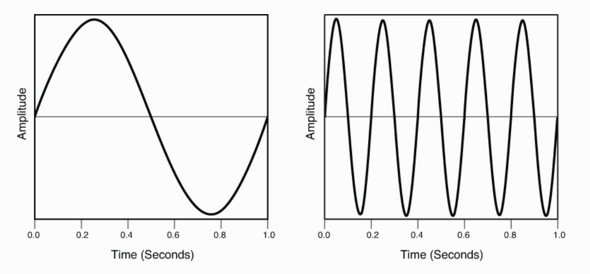
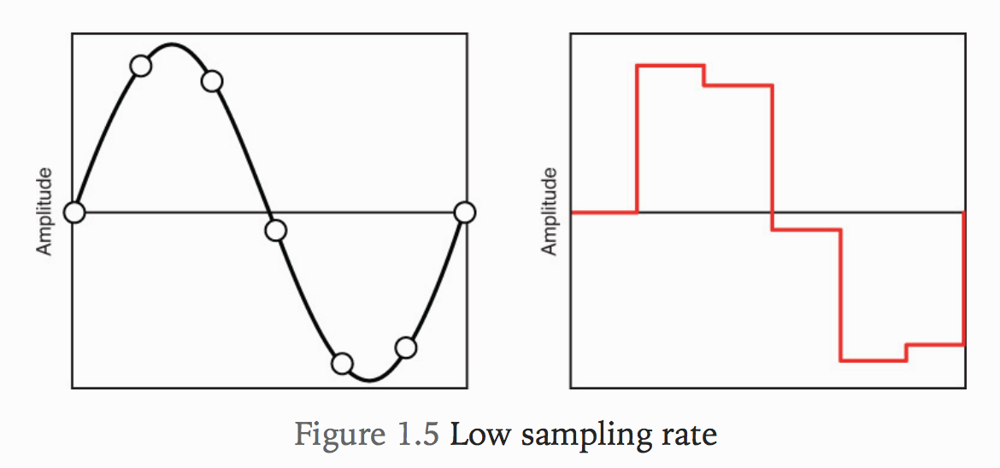
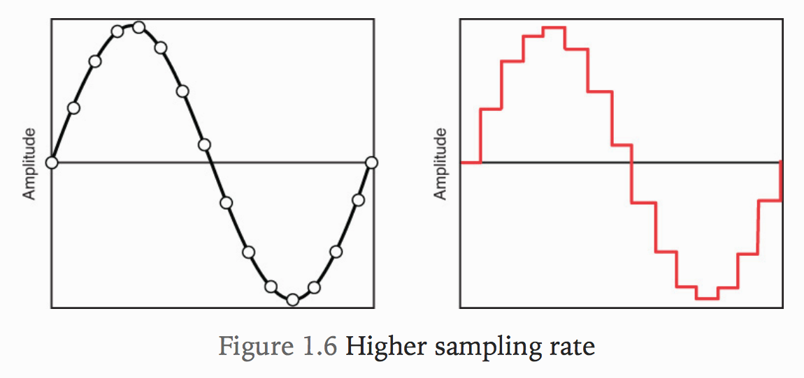
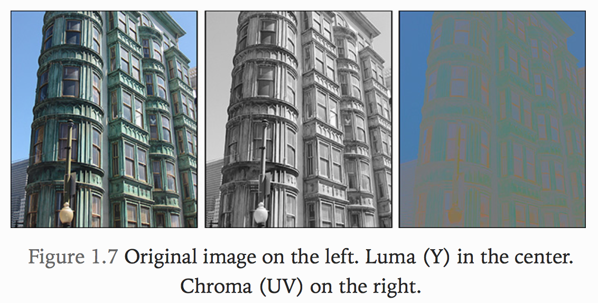
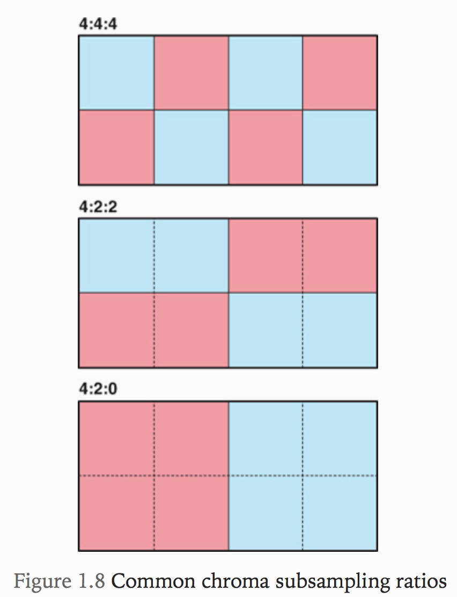

# 1. Getting Started with AV Foundation

* Apple은 오랫동안 디지털 미디어 세계에서 원동력이었습니다. 1991 년에 처음으로 디지털 오디오 및 비디오를 대중에게 가져온 QuickTime이 도입되었습니다. QuickTime 아키텍처는 향후 20 년간 디지털 멀티미디어에 혁명을 가져올 것이며 교육, 게임 및 엔터테인먼트 산업에 상당한 영향을 미칩니다. 2001 년에 Apple은 iTunes와 iPod에 세계를 소개하면서 음악을 듣는 방식을 근본적으로 바꿨습니다. 2 년 후 발표 된 아이튠즈 스토어는 음악 산업을 뒤흔들었고 이후 애플의 끊임없이 확장되는 디지털 미디어 생태계의 중심이되었다. 2007 년에 우리는 iPhone을 소개했고 몇 년 후 iPad를 출시했습니다. 이러한 이벤트는 완전히 새로운 컴퓨팅 시대를 열었으며 미디어를 제작, 소비 및 공유하는 방식을 영원히 바꿔 놓았습니다.
* 디지털 미디어의 세계는 기술적 인 측면에서만 더 이상 알려지지 않습니다. 오늘날 디지털 미디어는 간단하고 필수적이며 보편적이며 힘을 실어주고 있습니다. Instagram과 같은 앱을 사용하면 아름답고 예술적인 정지 이미지를 손쉽게 가져 와서 세상과 공유 할 수 있습니다. Skype에서 TangoMe에 이르는 화상 채팅 응용 프로그램을 사용하면 친구와 가족을 어디든지 데려 갈 수 있습니다. YouTube와 Netflix에서 제공하는 스트리밍 비디오는 결코 LTE 또는 Wi-Fi 신호 이상의 것입니다. iPad 용 Final Cut Pro X 및 iMovie와 같은 도구는 고급 사용자와 초보자 모두에게 손쉽게 비디오 편집 기능을 제공합니다.
* 디지털 미디어 혁명이 여기에 있지만, 이제 막 시작했습니다. AV Foundation을 사용하는 방법을 배우는 것이 Mac OS X 및 iOS 용 차세대 미디어 응용 프로그램을 만드는 열쇠입니다.이 책은 안내서로 사용됩니다. 프레임 워크의 필수 개요를 제공하여 프레임 워크를 마스터하는 데 필요한 통찰력과 이해를 제공합니다. Let's go!

## What is AV Foundation?
* AV Foundation은 OS X 및 iOS에서 시간 기반 미디어로 작업하기위한 Apple의 고급 Objective-C 프레임 워크이다.
* 이 소프트웨어는 하드웨어 가속 작업을 자동으로 제공하여 다양한 장치에서 최상의 성능을 보장한다. iPhone 및 iPad와 같은 장치의 요구 사항을 충족할 수 있도록 전력 효율이 높도록 설계되었으며 64 비트 하드웨어를 처음부터 최대한 활용하여 기본으로 64비트로 작성되었습니다.

## Where Does AV Foundation Fit?
* AV Foundation을 배우기 위한 첫 번째 단계 중 하나는 Apple의 전반적인 미디어 환경에서 어디에 해당되는지 명확하게 이해하는 것이다.



* 두 플랫폼은 모두 최신 비디오 재생 응용 프로그램을 단순화하는 AVKit 프레임 워크를 제공한다. 그러나 이러한 솔루션이 편리하기는 하지만 보다 고급 응용프로그램에 필요한 유연성과 제어 기능이 부족한 경우가 많다.
* 스펙트럼의 다른쪽 끝에는 모든 상위 레벨 솔루션에서 사용되는 지원기능을 제공하는 몇 가지 하위 프레임워크가 있다. 이러한 프레임워크는 C기반이지만 강력한 이해가 필요하다.
* 주요 지원 프레임워크 와 각 기능이 제공하는 주요 키를 살펴보자.
  * CoreAudio
    * Core Audio는 OS X 및 iOS의 모든 오디오 처리를 다루며 오디오 및 MIDI 컨텐트의 녹음, 재생 및 처리를 위한 인터페이스를 제공한다.
    * Apple의 Logic Pro X 및  Pro Tools와 같은 도구에서 사용되는 것과 같은 정교한 오디오 처리 기능을 구현할 수 있는 매우 낮은 수준의 인터페이스, 특히 Audio Units를 제공한다.
  * Core Video
    * Core Video는 OS X 및 iOS에서 디지털 비디오를 위한 파이프 라인 모델을 제공한다. 이미지 버퍼 및 버퍼 풀 지원을 Core Media에 제공하여 디지털 비디오의 개별 프레임에 액세스 하기위한 인터페이스를 제공한다.
  * Core Media
    * Core Media는 AV Foundation에서 사용하는 저수준 미디어 파이프 라인의 일부이다. 오디오 샘플 및 비디오 프레임 작업에 필요한 저수준 데이터 유형 및 인터페이스를 제공한다.
  * Core Animation
    * Core Animation은 OS X 및 iOS에서 제공되는 합성 및 애니메이션 프레임 워크이다. Core Animation을 사용하여 AV Foundation은 재생 및 비디오 캡처 시나리오에서 비디오 컨텐츠의 하드웨어 가속 렌더링을 제공한다. 또한 이를 이용하여 비디오 편집 및 재생 시나리오에서 움직이는 제목 및 이미지 효과를 추가할 수 있다.

* AV Foundation은 UIKit 및 AppKit 레이어 아래에 위치하기 때문에 두 플랫폼 모두에서 사용할 단일 미디어 프레임 워크가 있음을 의미한다. 배울 수있는 프레임 워크는 하나 뿐이며, 코드뿐 아니라 지식과 경험을 어느 플랫폼 으로든 포팅 할 수있는 기회를 제공한다.

## Decomposing AV Foundation
* AV Foundation을 사용하는 것을 배우는 데있어 가장 큰 어려움 중 하나는 프레임 워크가 제공하는 수많은 클래스를 이해하는 것이다.
* 제공되는 기능의 핵심 영역을 살펴보자.
  * Audio Playback and Recording
    * 그림 1.1의 오른쪽 위 모서리에 Audio-Only라고 표시된 작은상자.
    * AVAudioPlayer 및 AVAudioRecorder는 오디오 재생 및 녹음을 응용 프로그램에 통합하는 쉬운 방법을 제공한다.
  * Media Inspection
    * AV Foundation은 미디어를 검사하는 기능을 제공한다. 미디어 Assets을 검사하여 특정 작업에 대한 적합성을 판단할 수 있다.(예: 재생에 사용할 수 있는지 또는 편집하거나 내보낼 수 있는지 여부)
    * 재생 시간, 생성 날짜 또는 기본 재생 볼륨과 같은 미디어에 대한 기술적 속성을 검색할 수 있다.
    * AVMetadataItem 클래스를 기반으로하는 강력한 메카 데이터 지원을 제공한다.
  * Video Playback
    * AV Foundation의 보다 일반적인 용도 중 하나는 비디오 재생을 제공하는 것이다.
    * 이것을 사용하면 로컬파일이나 원격 스트림에서 비디오 에셋을 재생하고 비디오 내용의 재생 및 표시를 제어할 수 있다.
    * 이 영역의 중심 클래스는 자막 및 subtitles 정보와 같은 고급 기능을 통합할 뿐 만 아니라 Assets 재생을 제어할 수 있는 AVPlayer 및 AVPlayerItem 클래스이다.
  * Media Capture
    * AV Foundation은 다양한 API 세트를 제공하므로 Mac 및 모든 iOS의 내장 카메라 장치의 기능을 세밀하게 제어할 수 있다. 캡처 시나리오의 중심 클래스는 AVCaptureSession이다. 이는 카메라 장치 출력을 동영상 및 이미지 파일 뿐 만 아니라 미디어 스트림으로 라우팅하기 위한 활동의 중심 허브이다.
  * Media Editing
    * AV Foundation은 또한 미디어 구성 및 편집을 매우 강력하게 지원한다. 이 기능을 사용하면 여러 오디오 및 비디오 트랙을 함께 구성하고 개별 미디어 클립을 자르고 편집하고, 시간 경과에 따른 오디오 매개변수를 수정하고, 애니메이션 제목 및 전환 효과를 추가할 수 있는 응용 프로그램을 만들 수 있다.
  * Media Processing
    * AV Foundation에서 고급 미디어 처리를 수행해야 하는 경우 AVAssetReader 및 AVAssetWriter 클래스를 사용하여 처리할 수 있다. 이 클래스는 비디오 프레임 및 오디오 샘플에 직접 액세스 할 수 있으므로 필요한 고급 처리를 수행할 수 있다.

## Understanding Digital Media
* 우리가 보는 모든 시력과 모든 소리는 아날로그 신호로 우리에게 전달되며, 우리의 두뇌가 이를 전기적 자극으로 변환한다.
* 실제 세계의 신호는 주파수와 강도가 지속적으로 변하지만 디지털세계의 신호는 이산 상태이며 1 또는 0 중 하나의 상태를 가지고 있다.
* 아날로그 신호를 디지털 방식으로 저정하고 전송할 수 있는 형태로 변환하려면 샘플링이라고 하는 아날로그 - 디지털 변환 프로세스를 사용한다.

## Digital Media Sampling
* 미디어를 디지털화 할 때 사용되는 두가지 주요 유형의 샘플링이 있다.
  * 시간 샘플링 - 시간 경과에 따른 신호의 변화를 캡처할 수 있다. 예를들어 iPhone에 음성 메모를 녹음하면 녹음 기간 동안 피치와 음량의 연속적인 변화가 캡처된다.
  * 공간 샘플링 - 결과 디지털 이미지의 픽셀 데이터를 생성하기 위해 이미지의 luminance(light)와 chrominance(color)을 어느정도의 해상도로 캡처링하는 것을 포함한다.
* 아날로그 - 디지털 변환은 하드웨어 구성 요소가 처리하는데 이 처리방식과 디지털 미디어의 저장 형식에 대한 기본적인 이해를 하지 못하면 AV Foundation의 진보된 흥미로운 기능을 사용할 수 있는 능력이 제한될 것이다.

## Understanding Audio Sampling
* 누군가의 목소리, 경적 소리 또는 기타의 소리를 들을 때 실제로 들리는 소리는 어떤 매체에서 음파를 통해 전달되는 진동이다.
* 이 진동은 주위의 공기 분자를 움직이게 하고, 이웃하는 분자들과 밀착하여 초기 진동에서부터 모든 방향으로 연속적으로 에너지를 전달한다.
* 이 에너지가 귀에 닿으면 고주파가 동일한 주파수와 진폭으로 진동한다. 이 진동은 내이의 달팽이관으로 전달되어 뇌에 전달되는 전기 자극으로 변환된다.
* 마이크로폰(마이크)는 기계 에너지(음파)를 전기 에너지(전압)로 변환하는 변환장치이다.


* 말하는 부분인 헤드 케이스 안에는 다이어프램이라는 얇은 멤브레인이 있다. 다이어프램은 자석 주위에 싸인 와이어 코일에 연결된다. 마이크에 대고 말하면 진동판은 감지하는 음파와 관련하여 진동한다. 이것은 차례로 와이어 코일을 진동시켜 입력 신호의 주파수 및 진폭에 비례하여 전류를 발생시킨다.
* 오실로스코프를 사용하면 그림 1.3과 같이이 전류의 진동을 볼 수 있다.



* 오디오 신호의 필수 요소에 대해 좀 더 자세히 살펴보자. 톤 제너레이터를 사용하여 그림 1.4와 같은 사인파를 생성하는 두 가지 톤을 생성했다.



* 이 신호의 두가지 측면에 관심이 있다. 첫 번째는 신호의 전압 또는 상대 강도의 크기를 나타내는 진폭이다. 이것은 다양한 스케일로 나타낼 수 있지만 일반적으로 -1.0 ~ 1.0의 번위로 정규화된다. 이 신호의 또 다른 흥미로운 점은 주파수이다. 신호의 주파수는 헤르츠(Hz)로 측정된다. 이는 1초의 기간 동안 얼마나 많은 완전한 사이클이 발생했는지 나타낸다.
* 그림 1.4의 왼쪽에있는 이미지는 1Hz에서 순환하는 오디오 신호를 보여 주며 오른쪽에있는 이미지는 5Hz 신호를 보여준다. 인간은 20Hz ~ 20kHz (20,000Hz)의 가청 주파수 범위를 가지므로 두 신호 모두 들리지는 않지만 쉽게 설명 할 수 있다.

```
Note
인간의 청력은 20Hz ~ 20kHz의 가청 주파수 범위를 가지지 만, 그 범위는 실제로 이론적 경계를 나타냅니다. 시끄러운 환경에 노출 될 경우 청력이 감소하기 때문에 그 범위의 바깥 쪽에서 주파수를들을 수있는 사람은 거의없고 나이를 먹으면 빠르게 감소합니다. 락 콘서트에가 본 적이 있다면 그 범위의 윗부분이 없어 졌음을 확신 할 수 있습니다.
다양한 주파수의 사운드에 대한 참조 프레임을 제공하기 위해 피아노의 가장 낮은 건반 A0은 27.5Hz의 주파수를 생성하고 가장 높은 건반 인 C8은 약 4.1kHz의 주파수를 생성합니다.
```

* 오디오 Digitizing은 Linear PCM 또는 LPCM이라고 하는 선형 펄스 코드 변조 인코딩 방법을 포함한다. 이 프로세스는 샘플링 속도라고하는 고정 된 주기적 속도로 오디오 신호의 진폭을 샘플링하거나 측정한다. 그림 1.5는 1초동안 이 신호의 7개 샘플을 취한 결과 신호의 디지털 표현을 보여준다.



* 명백하게 낮은 샘플링 속도에서 이 신호의 디지털 버전은 원본과 거의 유사하지 않다. 이 디지털 오디오를 재생하면 클릭 수와 팝음이 거의 발생하지 않는다. 그림 1.5에 나와있는 샘플링의 문제점은 신호를 정확하게 포착하기에 충분히 빈번하게 샘플링하지 않는다는 것이다.
* 그림 1.6에서 다시 시도해보자. 이 때 샘플링 속도를 높여보자.



* 분명히 개선되었지만 여전히 신호의 매우 정확한 표현은 아니다. 그러나 이예에서 추측할 수 있는것은 샘플 속도의 빈도를 계속 늘리면 원래 소스를 상당히 정확하게 미러링 한 디지털 표현을 생성할 수 있어야 한다는 것이다.
* 벨 연구소에서 특정 주파수를 정확히 포착하기 위해서는 가장 높은 주파수 속도의 2배 이상의 속도로 샘플링 해야한다는것을 발견했다.
* 예를 들어 캡처하려는 오디오 자료의 최고 주파수가 10kHz 인 경우 정확한 디지털 표현을 제공하려면 적어도 20kHz의 샘플 속도가 필요하다.
* 비디오는 프레임이라고하는 일련의 이미지로 구성된다. 각 프레임은 비디오의 타임라인에서 특정 시점의 장면을 캡처한다.
* 1초에 표시되는 프레임 수는 비디오 프레임 속도라고하며 `초당 프레임 수(FPS)`로 측정된다. 가장 일반적인 프레임 속도는 24FPS, 25FPS 및 30FPS등이 있다.
* 압축되지 않은 비디오 컨텐츠의 저장 요구 사항을 이해하려면 먼저 각 개별 프레임의 크기를 결정해야한다. 다양한 일반적인 비디오 크기가 있지만 요즘에는 일반적으로 가로 세로 비율이 16 : 9이다. 즉 가로 세로 9 픽셀 당 16 개의 가로 픽셀이 있다. 이 종횡비의 가장 일반적인 두 가지 크기는 1280 × 720 및 1920 × 1080이다. 픽셀 자체는 어떻습니까? 8 비트를 사용하여 RGB 색상 공간의 각 픽셀을 표현한다면 빨강 색 8 비트, 녹색 8 비트, 파란색 8 비트 또는 24 비트를 가질 수 있다. 모든 입력이 모여서 몇 가지 계산을 수행해 봅시다. 표 1.1은 가장 일반적인 두 가지 해상도에서 30FPS의 비 압축 비디오 저장 요구 사항을 보여준다.


* 오늘날 대부분의 경우 이 방법은 적합하지 않다. 대부분의 비디오를 저장하고 전송하는 것이 합리적이지 않기 때문에 이 크기를 줄이는 방법을 찾아야 한다. 이것은 압축의 주제로 우리를 데려다 준다.

## Digital Media Compression
* 디지털 미디어의 크기를 줄이려면 압축을 사용해야한다. 사실 우리가 소비하는 모든 미디어는 다양한 수준으로 압축된다. TV에서 비디오, Blu-ray 디스크, 웹에서 스트리밍 또는 iTunes Store에서 구입 한 모든 것을 압축 형식으로 처리한다. 디지털 미디어를 압축하면 파일 크기가 크게 줄어들지만 품질은 거의 저하되지 않는다.

## Chroma Subsampling
* 비디오 데이터는 일반적으로 `Y'CbCr`이라는 컬러 모델을 사용하여 인코딩되며 일반적으로 `YUV`라고한다. YUV라는 용어는 기술적으로 부정확하지만 YUV는 Y-Prime-C-B-C-R보다 혀에서 벗어난 것 같다. 대부분의 소프트웨어 개발자는 모든 픽셀이 빨간색, 녹색 및 파란색의 값으로 구성되는 RGB 색상 모델에 더 익숙하다. Y'CbCr 또는 YUV는 대신 픽셀의 루마 채널 Y (밝기)와 채도 (색상) 채널 UV를 분리한다. 그림 1.7은 이미지의 루마와 크로마 채널을 분리하는 효과를 보여준다.



* 루마 채널에는 이미지의 모든 세부 사항이 보존되어 회색 음영 이미지가 남는 반면, 채도 채널을 결합하면 거의 모든 세부 사항이 손실된다는 것을 알 수 있다. 우리의 눈은 색보다 밝기에 훨씬 민감하기 때문에 영리한 엔지니어는 이미지의 품질을 유지하면서 각 픽셀에 저장된 색 정보의 양을 줄일 수 있다는 것을 깨달았다. 컬러 데이터를 줄이기 위해 사용되는 프로세스를 `크로마 서브 샘플링`이라고합니다.
* 4 : 4 : 4, 4 : 2 : 2 또는 4 : 2 : 0과 같은 숫자를 참조하는 카메라 사양이나 기타 비디오 하드웨어 또는 소프트웨어를 볼 때마다이 값은 사용하는 채도 하위 샘플을 참조합니다. 이 값은 J : a : b 형식의 luminance대 chrominance의 비율을 나타냅니다.
  * J : 일부 참조 블록 내에 포함 된 픽셀 수 (일반적으로 4)이다.
  * a :는 첫 번째 행의 모든 J 픽셀에 대해 저장되는 색차 픽셀 수이다.
  * b :는 두 번째 행의 모든 J 픽셀에 대해 저장되는 추가 픽셀 수이다.
* 이미지의 품질을 유지하려면 모든 픽셀마다 고유 한 luma 값이 필요하지만 자체의 채도 값을 가질 필요는 없다. 그림 1.8은 일반적인 서브 샘플링 비율과 각각의 효과를 보여준다.



* 모든 형태에서 전체 luminance가 모든 픽셀에 걸쳐 보존되며 4 : 4 : 4 풀 컬러 정보도 보존된다. 4 : 2 : 2에서는 색상 정보가 수평 2 픽셀마다 평균화되어 2 : 1 루마 - 크로마 비율을 얻는다. 4 : 2 : 0에서는 색상 정보가 수평 및 수직으로 평균화되어 4 : 1 루마 - 크로마 비율을 얻는다.
* 크로마 서브 샘플링은 일반적으로 획득 시점에 발생한다. 일부 전문 카메라는 4 : 4 : 4로 캡처하지만 더 일반적으로는 4 : 2 : 2로 캡처한다. iPhone에서 발견되는 것과 같은 소비자 지향적 인 카메라는 4 : 2 : 0으로 캡처된다. iPhone에서 촬영할 수 있는 비디오의 품질에서 알 수 있듯이 상당한 수준의 하위 샘플링에서도 고화질 이미지를 캡처 할 수 있다. 색상 손실은 후반 작업 과정에서 크로마 키잉 또는 색상 보정을 수행 할 때 더욱 문제가된다. 크로마 정보는 여러 픽셀에 걸쳐 평균화되므로 노이즈 및 기타 아티팩트가 이미지에 입력 될 수 있다.