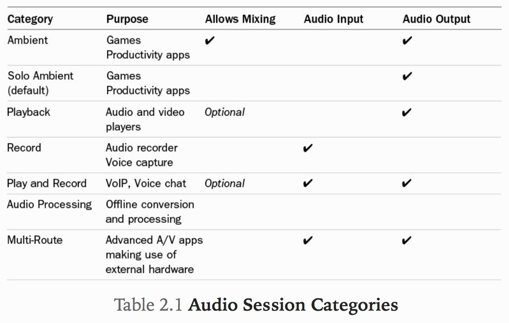

# 2. Playing and Recording Audio
 * AV Foundation은 오디오 전용 프레임 워크로서의 삶을 시작했습니다. iOS 2.2에서 소개 된 프레임 워크의 첫 번째 구체화에는 오디오 재생을 처리하는 단일 클래스가 포함되었습니다. iOS 3.0에서 Apple은 오디오 녹음 기능을 도입했습니다. 이러한 클래스는 프레임 워크에서 가장 오래된 클래스 중 일부이지만 여전히 가장 널리 사용되는 클래스입니다. 이 장에서는 AVAudioPlayer 및 AVAudioRecorder 클래스를 살펴보고 이러한 클래스를 활용하여 오디오 재생 및 레코드 기능을 응용 프로그램에 추가하는 방법을 살펴 봅니다.

### Mac and iOS Audio Environments
* 오디오 재생 및 녹음에 대한 논의를 시작하기 전에 Mac 및 iOS 플랫폼의 오디오 환경을 고려해야합니다. Mac의 오디오 환경은 매우 자유롭고 유연하며 주로 사용자의 통제하에 있습니다. GarageBand에서 iTunes에서 음악을 재생하고, QuickTime 동영상을보고, 인터넷을 통해 오디오를 스트리밍하고, 기타 리프를 녹음 할 수 있습니다. 이것은 느낌적인 과부하를 거의 확실하게 초래할지라도, OS X는 실행할 수 있습니다. 하드웨어 및 소프트웨어를 능동적으로 관리하여 오디오 사용자 환경을 관리하는 데 수동적인 역할을합니다.
* 일반적인 시나리오를 고려하여 iOS와 대조해 보겠습니다.
  * iPhone에서 노래를 듣기 시작하고 오디오가 내장 스피커를 통해 재생되면 전화가 걸립니다. 노래가 빠르게 사라지고 재생이 일시 중지되고 벨소리가 들리기 시작합니다. TPS 보고서에 커버 시트를 넣었는지 확인하기 위해 사장님이 전화를하므로 전화 거절을 결정합니다. 오디오가 다시 페이드 인하면서 노래가 다시 재생되기 시작합니다. 이제 iPhone의 내장 스피커가 고전적인 `Parliament-Funkadelic` 트랙에 대한 정의를하지 못한다는 것을 알게되므로 헤드폰을 연결하십시오. 오디오 출력은 트랙이 계속 재생되는 동안 헤드폰으로 보내집니다. 청취가 끝나면 헤드폰을 분리하면 오디오 신호가 내장 스피커로 자동 경로 지정되고 재생이 일시 중지됩니다.
* 기술 수준에서는 설명 된 시나리오에서 많은 복잡성이 있지만 사용자의 관점에서 볼 때 단순한 마술 일뿐입니다. iOS는 전반적인 iOS 사용자 경험의 아름다움을 더하는 관리 오디오 환경을 제공하지만 이 마법은 정확히 어떻게 발생할까? 이 동작은 오디오 세션을 사용하여 가능합니다.

### Understanding Audio Sessions
* 오디오 세션은 앱과 운영 체제 사이의 중개자 역할을합니다. OS와 오디오 통신이 어떻게 이루어지는 지 간단하고 세련된 방식으로 알려줍니다. 오디오 하드웨어와의 구체적인 상호 작용을 자세히 설명하는 대신, 의미론적으로 앱의 동작을 설명합니다. 이를 통해 앱의 일반적인 오디오 동작을 표시하고 이 동작의 관리를 오디오 세션에 위임 할 수 있으므로 OS가 사용자의 오디오 환경을 가장 잘 관리 할 수 있습니다.
* 모든 iOS 응용 프로그램은 오디오 세션을 사용하는지 여부에 관계없이 오디오 세션을 보유합니다. 기본 오디오 세션은 다음과 같은 동작으로 사전 구성됩니다.
 * 오디오 재생은 활성화되었지만 오디오 녹음은 허용되지 않습니다.
 * 사용자가 벨소리 / 무음 스위치를 "무음"모드로 전환하면 응용 프로그램에서 재생되는 모든 오디오가 음소거됩니다.
 * 장치의 잠금 화면이 표시되면 응용 프로그램의 오디오가 음소거됩니다.
 * 응용 프로그램에서 오디오를 재생하면 배경에서 재생되는 다른 모든 오디오는 음소거됩니다.

* 기본 오디오 세션은 많은 유용한 동작을 제공하지만 응용 프로그램에 올바른 동작인지 확인하는 것이 중요합니다. 기본 동작은 다양한 응용 프로그램에서 제대로 작동하지만 미디어 응용 프로그램을 개발할 때 거의 필요하지 않습니다. 다행히도 오디오 세션은 카테고리를 사용하여 우리의 특별한 요구에 맞추기 쉽습니다.

### Audio Session Categories
* AV Foundation은 응용 프로그램에서 제공하는 오디오 동작을 설명하는 데 사용되는 7 가지 범주를 정의합니다. 표 2.1에는 사용 가능한 범주와 관련 목적 및 동작이 나열되어 있습니다.
